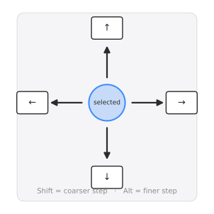
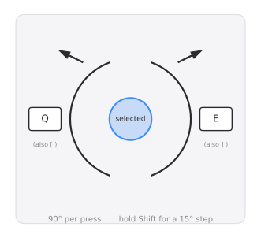

.. _gui-shortcuts:

*******************************
GUI Navigation & Shortcuts
*******************************

The desktop GUI (``MetalGUI``) can be driven entirely with the mouse, but
the keyboard shortcuts below are faster once a design has more than a
couple of components. They're also available in-app: press **?** or use
the Help button on the plot toolbar for the same reference without
leaving the GUI.

Mouse
=====

.. list-table::
   :widths: 20 80
   :header-rows: 0

   * - **Pan**
     - Drag with the left mouse button.
   * - **Zoom**
     - Scroll the mouse wheel. Zoom centers on the pointer.
   * - **Zoom to region**
     - Drag with the right mouse button to rubber-band a rectangle.
   * - **Select a component**
     - Click it.
   * - **Edit a component**
     - Double-click it, or click a component that's already selected.

Move the selected component
============================

Click a component to select it, then use the arrow keys.

Hold **Shift** while nudging for a coarser step, or **Alt** for a finer
one — the same modifier convention most drawing tools use.

Rotate the selected component
===============================

**Q** / **E** rotate counter-clockwise / clockwise in 90° steps — the
same convention used for rotation in many games and creative tools.
**[** / **]** do the same thing, for anyone who prefers the bracket
keys. Hold **Shift** for a finer 15° step instead of 90°.

Other shortcuts
================

.. list-table::
   :widths: 30 70
   :header-rows: 0

   * - **A**
     - Fit the view to the design (components only).
   * - **Shift+A**
     - Fit the view to the whole chip, including the die outline.
   * - **R** (also **Ctrl+D**)
     - Rebuild the design.
   * - **?**
     - Open this reference in-app.

Editing a component's options replots without moving the camera, so your
current zoom and pan are preserved.
